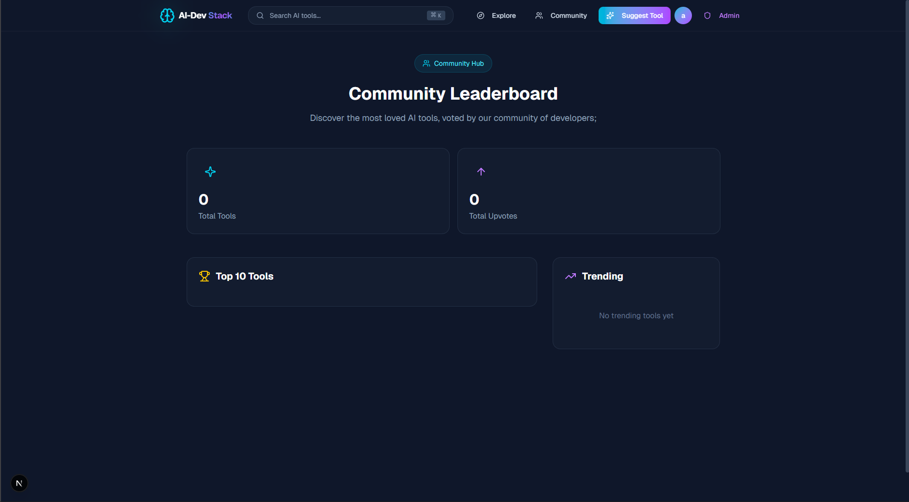

# 🤖 AI-Dev Stack

> A curated directory of AI tools for developers — built to explore, vote and discover the best AI-powered tools for your workflow.

<!-- 📸 IMAGE: Hero screenshot showing the Home page with tool cards, filters and search bar -->


## 📋 About

AI-Dev Stack is a full-stack web application built as a personal portfolio project. It allows developers to discover and explore AI tools, upvote their favorites, suggest new tools, and track community engagement through rankings and leaderboards.

The platform includes a complete admin panel for tool moderation, ensuring content quality and relevance.

## ✨ Features

- **🔐 Authentication** — Register and login with JWT-based authentication
- **🔍 Explore** — Browse AI tools with filters by pricing, type and tech stack
- **⬆️ Upvote** — Vote on your favorite tools and see community rankings
- **💡 Suggest** — Submit new AI tools for community review
- **👥 Community** — Leaderboard with top 10 most voted tools and trending section
- **👤 Profile** — View your upvoted tools and submitted suggestions
- **🛡️ Admin Panel** — Approve, feature, edit and delete tool suggestions

<!-- 📸 IMAGE: Screenshot showing the Community page leaderboard -->


## 🛠️ Tech Stack

### Frontend
- **Next.js 14** — App Router, Server Components
- **TypeScript** — Type safety throughout
- **Tailwind CSS v4** — Utility-first styling
- **TanStack Query** — Data fetching and caching
- **Framer Motion** — Animations
- **Shadcn/UI** — Component library

### Backend
- **Java 21** with **Spring Boot 4**
- **Spring Security** + **JWT** — Authentication
- **Spring Data JPA** + **Hibernate** — ORM
- **PostgreSQL** — Database
- **Docker** — Containerization

## 🚀 Getting Started

See the individual READMEs for setup instructions:

- [Frontend README](./frontend/README.md)
- [Backend README](./Backend/README.md)

## 📁 Project Structure

```
AI-Dev-Stack/
├── Frontend/          # Next.js 14 application
└── Backend/           # Spring Boot API
```

## 👨‍💻 Author

**Kauã Albuquerque** — [@Kauaalbuquerque](https://github.com/Kaualbuquerque)
