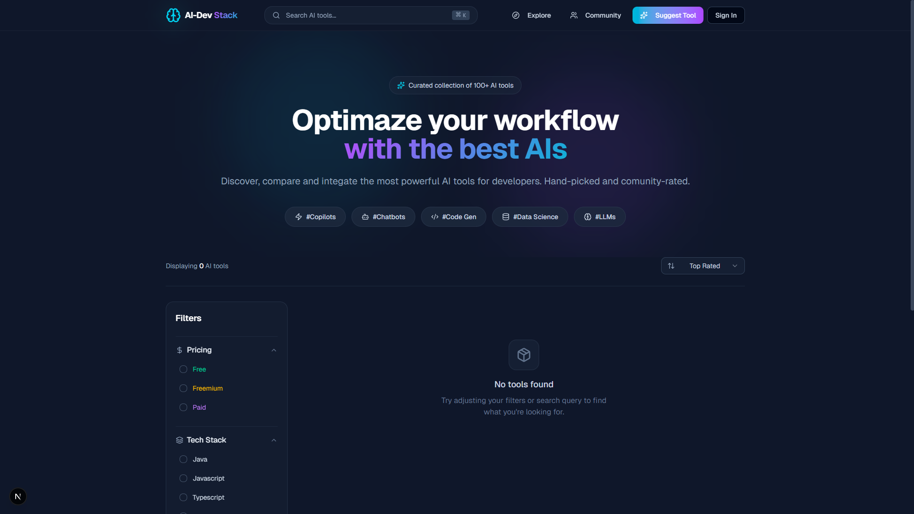
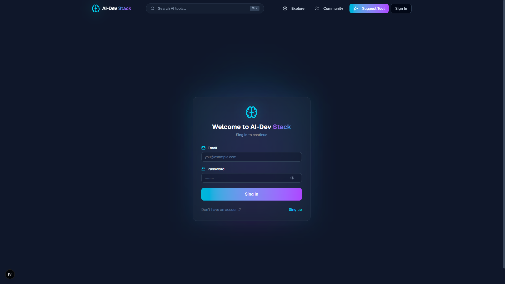
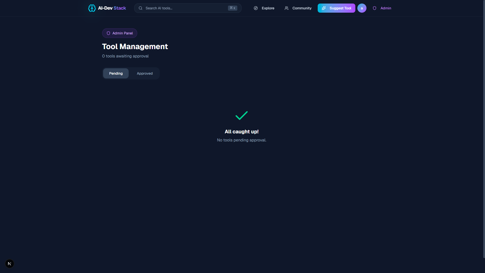

# 🖥️ AI-Dev Stack — Frontend

Next.js 14 application for the AI-Dev Stack platform.

<!-- 📸 IMAGE: Screenshot of the Home page with tool grid, filter sidebar and search bar -->


## 🛠️ Tech Stack

- **Next.js 14** — App Router, Server and Client Components
- **TypeScript** — Type safety throughout the application
- **Tailwind CSS v4** — Utility-first styling with custom theme
- **TanStack Query** — Data fetching, caching and state management
- **Framer Motion** — Animations and transitions
- **Shadcn/UI** — Accessible component library built on Radix UI
- **Sonner** — Toast notifications

## 📁 Project Structure

```
app/
├── (pages)/
│   ├── profile/           # User profile page
│   ├── community/         # Community leaderboard
│   ├── suggest-tool/      # Tool suggestion form
│   ├── tool-details/      # Tool detail page
│   ├── admin/             # Admin panel
│   ├── sign-in/           # Login page
│   └── sign-up/           # Register page
├── components/
│   ├── home/              # Home-specific components
│   └── ui/                # Reusable UI components
├── services/              # API service functions
├── types/                 # TypeScript interfaces
├── hooks/                 # Custom React hooks
├── lib/                   # Utilities and context
└── api/                   # API client (apiFetch)
```

## ✨ Pages

| Page | Description |
|------|-------------|
| **Home** | Tool directory with filters, search and pagination |
| **Tool Details** | Full tool info with upvote and share |
| **Community** | Leaderboard with top 10 and trending tools |
| **Profile** | User upvoted tools and suggestions |
| **Suggest Tool** | Form to submit a new AI tool |
| **Admin** | Approve, feature, edit and delete tools |
| **Sign In / Sign Up** | JWT authentication pages |

<!-- 📸 IMAGE: Screenshot of the Sign In page -->

<!-- 📸 IMAGE: Screenshot of the Admin panel with Pending and Approved tabs -->

<!-- 📸 IMAGE: Screenshot of the Profile page showing upvoted tools and suggestions -->


## ⚙️ Environment Variables

Create a `.env.local` file in the `Frontend/` directory:

```env
NEXT_PUBLIC_API_URL=http://localhost:8081
```

## 🚀 Getting Started

### Prerequisites
- Node.js 18+
- Backend API running (see [Backend README](../Backend/README.md))

### Installation

```bash
# Navigate to the frontend directory
cd Frontend

# Install dependencies
npm install

# Start the development server
npm run dev
```

The application will be available at `http://localhost:3000`.

### Build for production

```bash
npm run build
npm start
```
